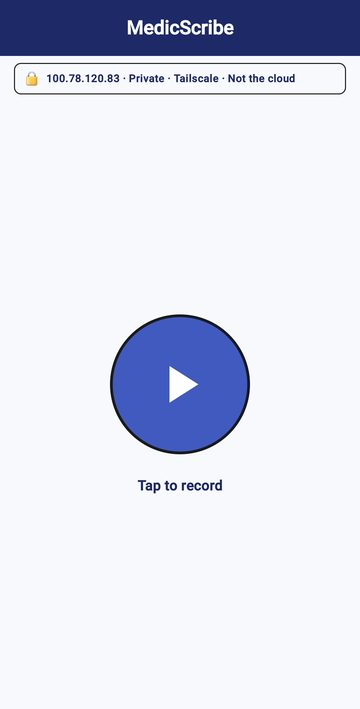
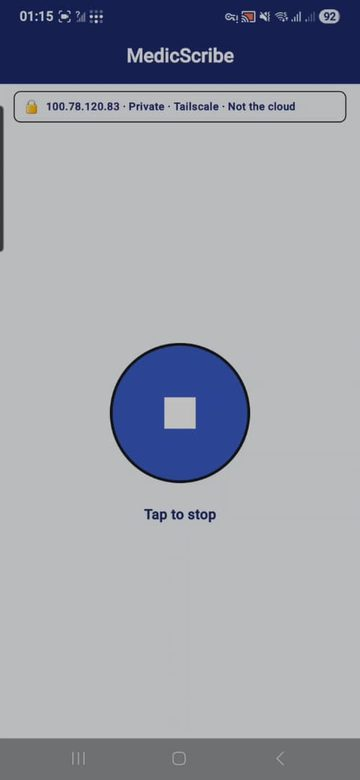
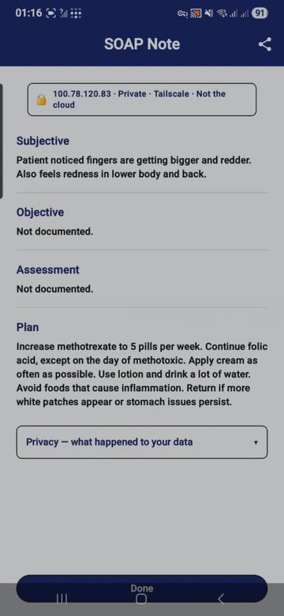
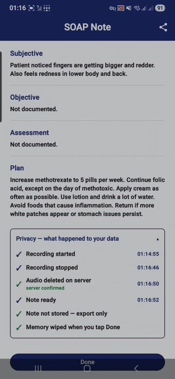

<b>MEDICAL TRANSCRIPTION AI</b>

# MedicScribe

### An AI medical scribe for Malaysian clinics
*by Sunkarilabs*

**Data Sovereignty · Zero-Cloud Liability · Specialized Medical Intelligence**

MedicScribe lets your doctors **speak naturally with the patient** while the AI writes the clinical note. One button to start, one to stop — a clean, structured SOAP note appears on screen seconds later, ready to review, edit, and export.

It is **working and field-tested today**. The screenshots in this document are from the live app.

---

## The clinical value

- **Gives time back.** Less typing during and after the visit means more attention on the patient and a faster clinic.
- **Speaks how Malaysia speaks.** Built on speech-recognition models tuned for Malaysian multilingual consultations — English, Malay, Mandarin and Tamil, plus local **dialects and everyday slang (Manglish)**, even mixed in the same sentence — and still produces a clean **English** note.
- **Structured and ready.** Notes come back in the familiar Subjective / Objective / Assessment / Plan format, captured straight from the conversation.

> MedicScribe is powered by highly advanced, localized enterprise AI models that scale seamlessly based on your clinic's volume and simultaneous user requirements.

---

## See it in action

|  |  |  |  |
|---|---|---|---|
| **1. Start** — one button; banner reminds you the data is private, not the cloud. | **2. Recording** — the button becomes Stop. Nothing else to manage. | **3. The note** — a ready SOAP note you can edit and Share. | **4. Privacy trail** — proof of exactly what happened to the data. |

In this real example, MedicScribe captured the patient's complaint and a detailed medication plan from a two-minute conversation, and the note was ready a few seconds after Stop.

---

## Private by design — zero cloud, zero liability

Most medical scribes send the recording to a company's servers on the internet. For patient data, that is a permanent liability. MedicScribe never does.

- **Data sovereignty.** The audio and the note live only on a private machine you control — no cloud account, no foreign data centre, no vendor holding your records.
- **Zero-cloud liability.** Nothing leaves the building, so there is no cloud breach surface to be liable for — a clean answer for PDPA 2010.
- **Proof, every time.** The app shows that the audio was deleted, the note is export-only, and everything is wiped when the doctor taps Done.

---

## The sealed "black box"

MedicScribe runs on a sealed, **headless** AI appliance — no screen, no desktop, nothing for staff to open, configure, or break. It is locked down and fully automated.

- **Zero tinkering, zero maintenance** for your clinic staff — it simply runs.
- **Engineered for uptime** — no software clutter, so virtually nothing to go wrong.
- **Nothing to lose.** If it is ever interrupted, no consultation data is lost — your team just carries on.

**Fits your clinic's devices:** MedicScribe is fully compatible with both iPad (iOS) and Android tablets, seamlessly integrating into your clinic's existing hardware preference.

---

## Next step — collaborative trial deployment

> Every clinic group has a unique layout, device preference, and consultation volume. **Sunkarilabs works closely with your team to customise a pilot deployment** that seamlessly integrates with your branch workflow — delivered within **30 days** of requirement finalisation.

Tell us your branch layout, device preference, and rough consultation volume, and we will shape a pilot around it. The next move is yours.

---

## Get in touch

**Surenther Saravanan** — Sunkarilabs
Phone / WhatsApp: **014-635 7916**
Email: **surenthersaravanan@gmail.com**

---

*MedicScribe by Sunkarilabs — Data Sovereignty · Zero-Cloud Liability · Specialized Medical Intelligence.*
